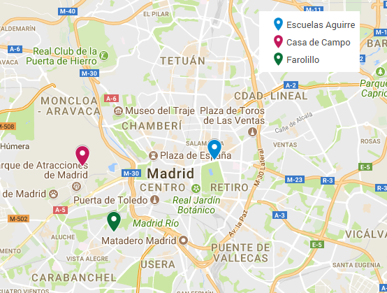

## Descripción

Esta aplicación ha sido desarrollada para el proyecto "TITULO DEL PROYECTO", como parte del proyecto fin de curso del máster "**Análisis y Visualización de Datos Masivos**", en el marco práctico de evaluación de la calidad del aire de la ciudad de Madrid.

El objetivo principal de esta herramienta es:

- proporcionar una solución global e interactiva que permita visualizar adecuadamente los resultados más relevantes del proyecto.
- mostrar la evolución histórica del índice de la calidad del aire (ICA), así como de los principales contaminantes y agentes meteorológicos relacionados con ella.
- mostrar los valores del ICA devueltos por el modelo predictivo desarrollado como parte del proyecto "TITULO DEL PROYECTO".

El índice de calidad de aire (ICA) es un indicador que sirve para informar de la calidad del aire a la población de una manera clara y sencilla. Generalmente la representación del ICA se dividide en cinco categorías, que definen los estados de calidad de aire según sea "muy buena", "buena", "mejorable", "mala" o "muy mala". Los valores límite seleccionados que conforman la escala de etiquetas lingüísticas anterior son los siguientes:

## Contenido

El contenido de la herramienta se divide fundamentalmente en dos apartados:

- Analítica descriptiva: en esta pestaña se encuentra las representaciones gráficas relacionadas con la información histórica recopilada. En particular, se puede interactuar con la evolución interanual del ICA, de los contaminantes SO2, CO, NO2, O3 y PM10, y de los agentes meteorológicos temperatura, lluvia, presión y humedad.
- Analítica predictiva: en esta pestaña se encuentra la predicción detallada del ICA para las próximas 24 horas y para los próximos 7 días. Además, se muestra la predicción de la evolución media del ICA para el año 2018 entero.

## Estaciones de control

A pesar de que los datos históricos relativos a los contaminantes se han descargado para las estaciones de control existentes en la ciudad de Madrid, el estudio detallado ofrecido en esta herramienta se ha limitado a tres: Casa de Campo, Escuelas Aguirre y Farolillo. La razón principal de la selección de estas tres estaciones de control es que cada una de ellas pertenece a un tipo de estaciones de control: urbanas de fondo (Farolillo), urbanas de tráfico (Escuelas Aguirre) y suburbanas (Casa de Campo).

La localización exacta de cada una de las anteriores estaciones de control se muestra sobre el siguiente mapa:

## Datos de interés

Toda la información referente a este proyecto se encuentra accesible al público a través del repositorio de GitHub: https://github.com/luciafs/VISA_TFM-LFS